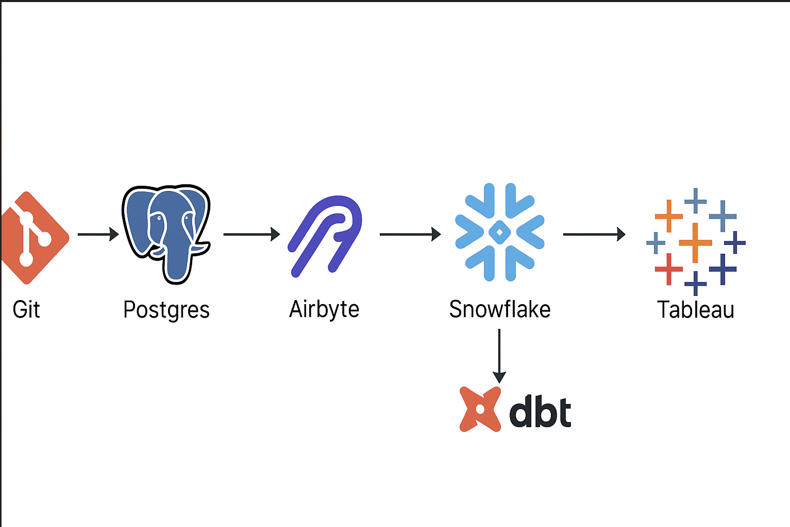
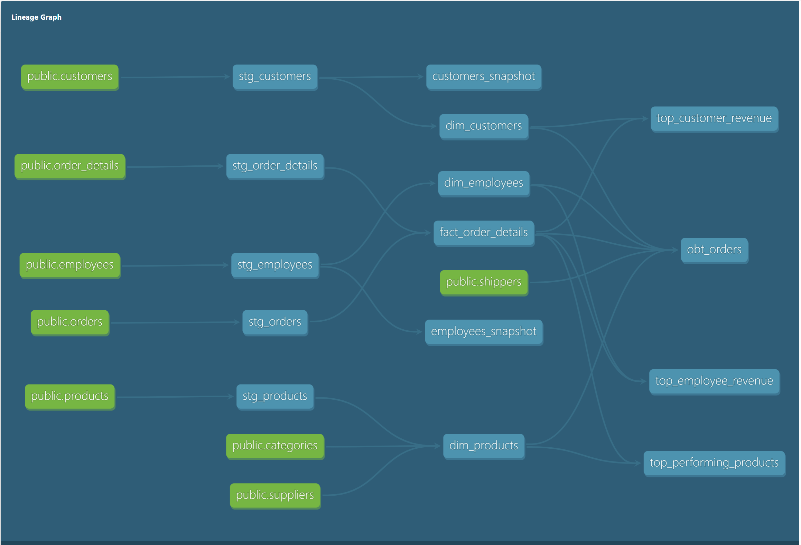
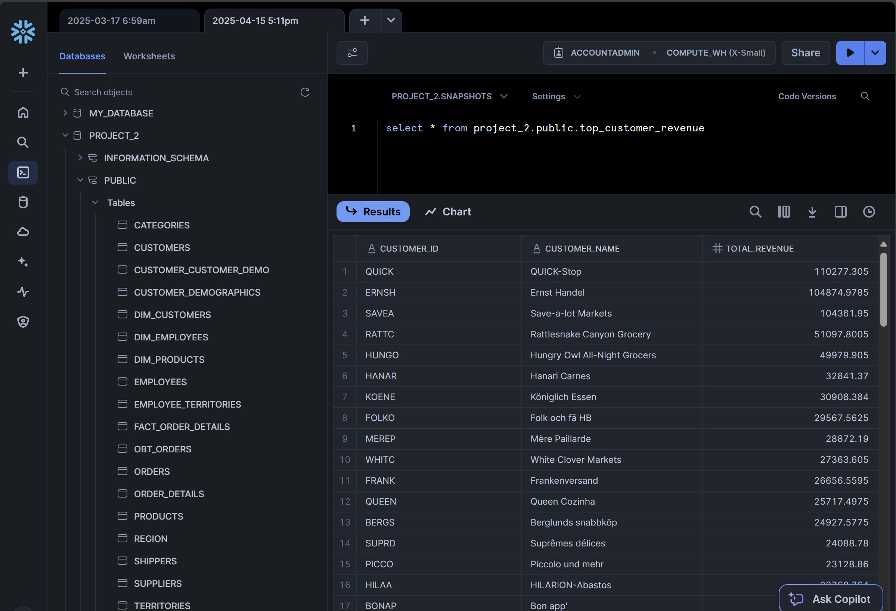
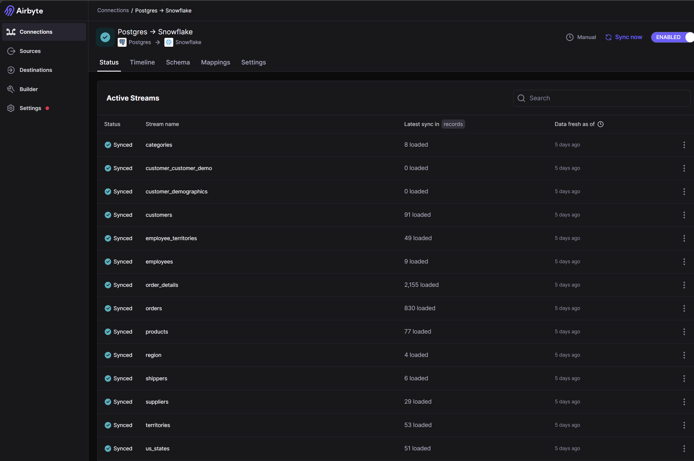

## **Northwind Data Pipeline with PostgreSQL, Airbyte, Snowflake, and dbt**

This project demonstrates an end-to-end ELT pipeline using PostgreSQL, Airbyte, and dbt, with final storage and visualization in Snowflake and Tableau. It involves extracting data from a cloned GitHub repository, loading it into PostgreSQL, syncing it to Snowflake using Airbyte, transforming the data using dbt, and visualizing it in Tableau.

During data transformation with dbt, these business models and isights were captured and solved:
-- Top Customer Revenue
-- Top Employee Revenue
-- Top Performing Products
-- one OBT
-- Three Dimension Tables
-- One Fact Table
-- Two snapshots to capture SCD2 applied on both Customer and Employee Tables

## Full ELT connection

## dbt docs lineage image

## Snowflake image

## Airbyte Connection image

## Tech Stack

-- PostgreSQL: Intermediate staging database

-- Airbyte: Data ingestion and replication tool

-- Snowflake: Final data warehouse

-- dbt (Data Build Tool): Transformations and modeling

-- Tableau: Data visualization tool

## Getting Started

Clone the GitHub Repository of Northwind because Airbyte cannot pull .sql files directly from GitHub
Create a project folder in the VScode 

cd <project_folder>
git clone https://github.com/pthom/northwind_psql.git

# Set Up PostgreSQL with Docker
Create a folder structure like this:
northwind_pg_docker/
├── docker-compose.yml
└── init/
    └── northwind.sql

## Paste the following into your docker-compose.yml:
version: '3.8'

services:
  northwind-db:
    image: postgres:14
    container_name: northwind-db
    ports:
      - "5433:5432"
    environment:
      POSTGRES_USER: postgres
      POSTGRES_PASSWORD: postgres
      POSTGRES_DB: northwind
    volumes:
      - ./init:/docker-entrypoint-initdb.d

# Start the PostgreSQL container:
docker-compose up -d

## Verify the container is running:
docker ps

## Access pgAdmin in Browser
## Visit http://localhost:5050 and log into pgAdmin.
## Register your PostgreSQL server:
-- Host: db

-- Port: 5432

-- Username: postgres

-- Password: postgres

-- Check "Save password"

## Load Northwind Data into PostgreSQL
## Manually load the dataset into the database:
psql -U postgres -d northwind -f northwind.sql

## Set Up Airbyte Connection
## Launch Airbyte.
## Source: PostgreSQL (point to the running Docker container).
## Destination: Snowflake 
## Sync the Northwind data from PostgreSQL to Snowflake.

## dbt Workflow
## Initialize a dbt Project
## Configure profiles.yml
snowflake_project:
  target: dev
  outputs:
    dev:
      type: snowflake
      account: <your_account>
      user: <your_user>
      password: <your_password>
      role: <your_role>
      database: <your_db>
      warehouse: <your_wh>
      schema: <your_schema>
      threads: 12
      client_session_keep_alive: False

## Test Your dbt Connection
dbt debug

## Run Models
dbt deps  ----- Installs packages listed in packages.yml
dbt compile  ------ Compiles models to raw SQL
dbt run

## Test Models
dbt test
dbt clean ----- Deletes compiled files and dbt_modules

## View Documentation
dbt docs generate
dbt docs serve

## Full Refresh for Incremental Models
dbt run --full-refresh

# Connect Snowflake to Tableau
## After dbt has loaded your transformed models into Snowflake:

## Summary
## This project walks through:

-- Cloning a GitHub dataset

-- Deploying PostgreSQL with Docker

-- Ingesting and syncing data using Airbyte to Snowflake

-- Transforming data using dbt

-- Visualizing in Tableau